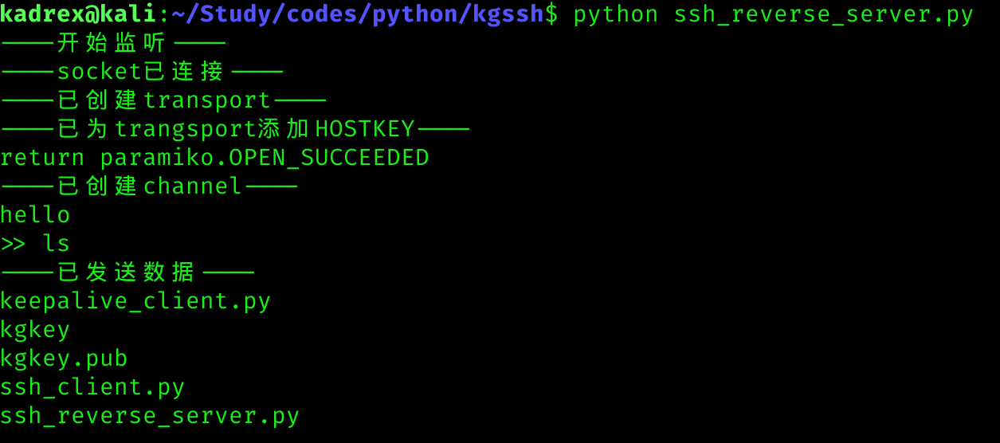

# 介绍
## 主要工具：kgssh
集成了ssh客户端、ssh服务器、ssh反向客户端、ssh反向服务器。且对于ssh反向客户端，会持续发出连接请求，所以只要运行该程序，可以持续反弹shell，稳定性较好   
## 其他工具
三个简单的工具：  
- keepalive\_client.py: 作为搭建在渗透目标上的ssh客户端，长时间连接目标的服务器，并反弹自身的shell给服务器  
- ssh\_reverse\_server: 作为ssh服务器，反向获取ssh客户端的shell  
- ssh\_client.py: 作为ssh客户端，仅让目标执行一条命令  
  
# 使用实例
  
  

# 技术回顾
本次主要使用了paramiko库来实现ssh的核心功能。  
- 创建客户端的channel的过程为： SSHClient -> Transport -> channel  
- 创建服务端的channel的过程为： socket -> Transport -> channel  
channel可以使用类似socket的各种方法来收发数据，ssh的加密、解密过程会自动完成。  
